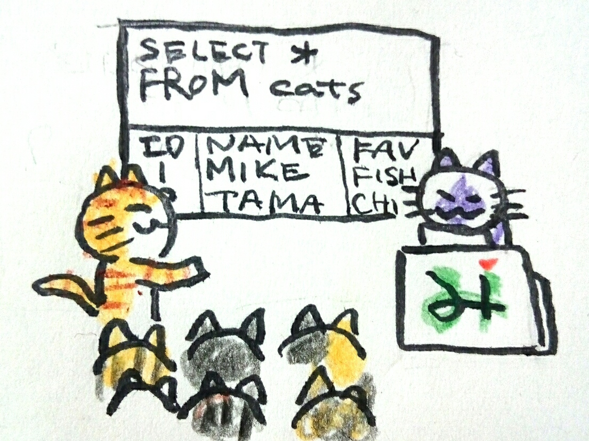

# ニャーQL勉強会

ニャーQL勉強会とは、エンジニア以外のひとが集まって、SQLを書けるようになるための勉強会です。

ニャーQLっていうのは、参加者のひとりが言ってくれたフレーズで、自分で言いだしたわけじゃないんです。こういうキャッチーな言葉をサッと言えるようになりたいですねえ…。

## 教材

勉強会といっても、別にプロの講師でもなんでもないので、教材を持ってるわけじゃないです…。

ですので、うちの会社の書棚にあった[「改訂第3版 すらすらと手が動くようになる SQL書き方ドリル」](https://gihyo.jp/book/2016/978-4-7741-8066-3)を使うことにしました。
特徴として、SQLの簡単な解説と例題があり、それを使った演習問題をこなしながら進めていく点があります。

読むだけでなく、実際にSQLを書いて動かして結果を見れる点と、書く順序について書かれているので、非常に覚えやすそうでした。

`INSERT`や`UPDATE`、`CREATE TABLE`なども扱ってますが…。業務で扱えるのは、危険を伴わない`SELECT`だけと思い、ひとつのテーブルを扱う2章、複数のテーブルを扱う3章までにしました。

### 内容

本の目次から持ってきたんですが…小さくて見えないですよね。
なんとなく小さなステップを刻んでいく感じなのは…伝わりますか。
ひとつのテーブルを扱う2章は16セクション、複数のテーブルを扱う3章は10セクション。合計26セクションで構成されています。基本を覚えるところが手厚めです。

- 第2章ひとつのテーブルを扱う
  - その１　データを取り出す　顧客一覧を出してくれ
  - その２　複数の列を指定する　商品ごとの単価を出してくれ
  - その３　列に別名をつける　項目の名前がわからない
  - その４　列の値に対して演算を行う　税込価格で一覧を出してくれ
  - その５　列同士で演算を行う　社員の健康状態を一覧で出してくれ
  - その６　文字列の連結を行う　名札を作ってくれ
  - その７　集合関数を使う　平均を教えてくれ
  - その８　ある条件でレコードを絞り込む（1）　身長が大きな人を教えてくれ
  - その９　ある条件でレコードを絞り込む（2）　「〜子」という名前の人の人数を教えてくれ
  - コラム　「*」って何？
  - その10　列の値に条件を設定する　単価別にランク付けしてみてくれ
  - その11　グループ単位で集計する　都道府県別の顧客数を教えてくれ
  - その12　グループ単位で集計した結果を絞り込む（1）　顧客数が3人以上の都道府県を教えてくれ
  - その13　グループ単位で集計した結果を絞り込む（2）　法人客の数が2人以上の都道府県を教えてくれ
  - その14　クロス集計を行う　社員の血液型別の人数ってどうなってるんだろう
  - その15　並び替えを行う　単価の安い順に商品名を出してくれ
  - その16　重複を排除する　住所一覧を出してくれ
- 第3章複数のテーブルを扱う
  - 特別講義（1）　結合とは　ここから先に進む前に！
  - その１　副問い合わせを使う　販売数量がゼロの商品を教えてくれ
  - 特別講義（2）　テーブルに別名をつける　ここから先に進む前に！
  - その２　複数テーブルの結合を行う（1）　再び都道府県別の顧客数を教えてくれ
  - その３　複数テーブルの結合を行う（2）　部門別の平均給与額を教えてくれ
  - コラム　名前付きSELECT文としてのビュー
  - その４　外部結合を使う　全部の商品の平均販売単価を教えてくれ
  - その５　自己結合を使う　セット商品の候補を考えてくれ
  - その６　相関副問い合わせを使う　商品別の平均販売数量よりも多く売れている日を教えてくれ
  - 特別講義（3）　集合演算とは　ここから先に進む前に！
  - その７　UNION ALLを使う　顧客と社員の名前一覧を出してくれ
  - その８　UNIONを使う　重複のない顧客・社員の名前一覧にしてくれ
  - その９　INTERSECTを使う　給料日に販売をした社員の一覧を出してくれ
  - その10　EXCEPTを使う　販売をしたことがない社員の一覧を出してくれ

### よいところ

この本の何より素晴らしいところは、サンプルデータベースがねこであることです。
単に自分がねこ好きだからというだけでなく、勉強の教材として見た目だけでも柔らかく簡単に見えそうなことが、参加者に第一歩を踏み出してもらうために重要だと感じています。

それから、学習を小さな単位で繰り返し徐々に覚えていく、ドリル形式であることもとてもよいです。
確実にできることが増えていっていることが実感できると思います。

また、この本の最大のウリである、書き順も素晴らしいです。
考える順に従っているので、とてもよいと思います。
ただ…クエリを一気に組み立てるように書かれており、そのままやるとtypoで苦しむので、少しずつ組み立てるように今は教えています。

- サンプルデータベースがねこ
- ドリル形式
- 書き順が書いてあること

### おしいところ

この本には惜しいところがあって、問題や解答がまちがっているところがあります。
教科書は絶対だ！と信じてやってしまうと、気づかずにスルーしてしまいます。
勉強会では、自分が見ているので、そういったところには説明をいれています。
（ひとりでやる場合には、鵜呑みにしないことと、検算をすることが大事になりそうです。）

- 問題や解答がまちがってるとこがある

# 当初の形式

毎朝 9:30 から 30分、事前に予習してきたことについて、わからないことを訊いてもらったり、演習問題の回答を前で発表したりする形にしました。
期間はあまり長くなってしまうとみんな続かなくなってしまいそうなので短めにしたく…
でも、26セクションもあって、数を見ると26セクション、毎日1〜2セクションで進んでも1ヶ月半から2ヶ月程度掛かりそうな予定でした。

- 毎朝 9:30 〜 10:00
  - 事前に予習してくる
  - 例題、解説を読む
- 演習問題をやってくる
- 勉強会中にわからなかったことを訊く
- 解いてきた演習問題を前で発表する
- 1セクションあたり、1〜2回でやると、1ヶ月半〜2ヶ月程度かかる。
  - 長くなると続かないような気がしたので、あまり終わらないときには切り上げて次に進む感じで…。
- 参加者は5人→10人（途中で増えました）

## 予習・発表の形式にしたねらい

少しハードルが高くなってしまうのはわかっていましたが、勉強会の形式を予習・発表の形式にしたのには狙いがありました。
予習でやってもらう演習は実際に手を動かしてもらい、体で感じてほしいという思いでした。
回答を前で発表する形式をとったのは、予習をやってきたひとに活躍の場を作りたかったことと…
発表を見ているひとは、自分と同じ立場のひとが解いていることを目の当たりにすれば、自分にもできる！と思えるかと思ったのでした。

- デメリット
  - 参加ハードルが上がってしまう
- メリット
  - 聴くだけでなく、手を動かしてほしい
  - 発表することで、キチンとやってきたことをみんなでほめたい
  - 発表できなかったひとも、同じ立場のひとが解いた事実から
  - 自分もできそうだと思えそう

# 参加者がつまづいたところ

始める前に、`WHERE`、`COUNT`や`SUM`などの集計、複数テーブルをつなげる`JOIN`あたりはつまづきそうと想定していましたが…

- WHERE
- 集計
- JOIN
- UNION

実際に始めてみると…
整数の演算結果と実数の演算結果の違うこと…
実データに出てくるUNIX時間と日付やタイムスタンプへの相互変換、当然タイムゾーンなんかもでてきます。
日付の変換がいくつも関数を入れ子にするんですが、この関数の入れ子自体も苦手だったりもしました。
人類にはまだ早い、NULLと0の差だったり…。
カラムの横持ちのときにCASEの条件をちゃんとするのが難しかったり、(ドリルも間違えていた…。)
副問合せ…他の方法で解決できることもあるものですから、なかなか使わないですね…自分もですが。

- 整数と実数の演算結果の差
- 日付、タイムスタンプ、UNIX時間の間の変換、タイムゾーン
- 関数の入れ子が苦手
- NULLと0
- カラムの横持ちのときのCASE
- 副問合せ

こんな感じで結構でてきて…どうしたものかと頭をなやませました。
