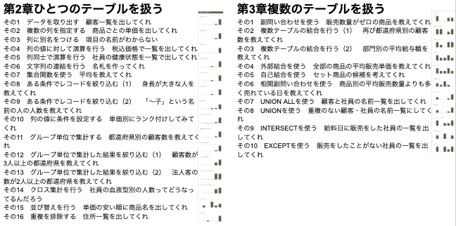
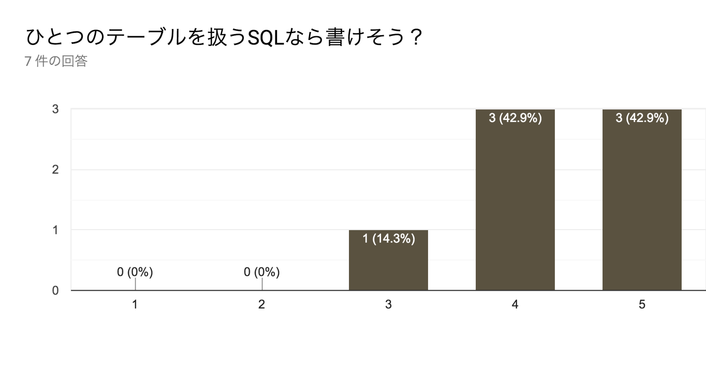
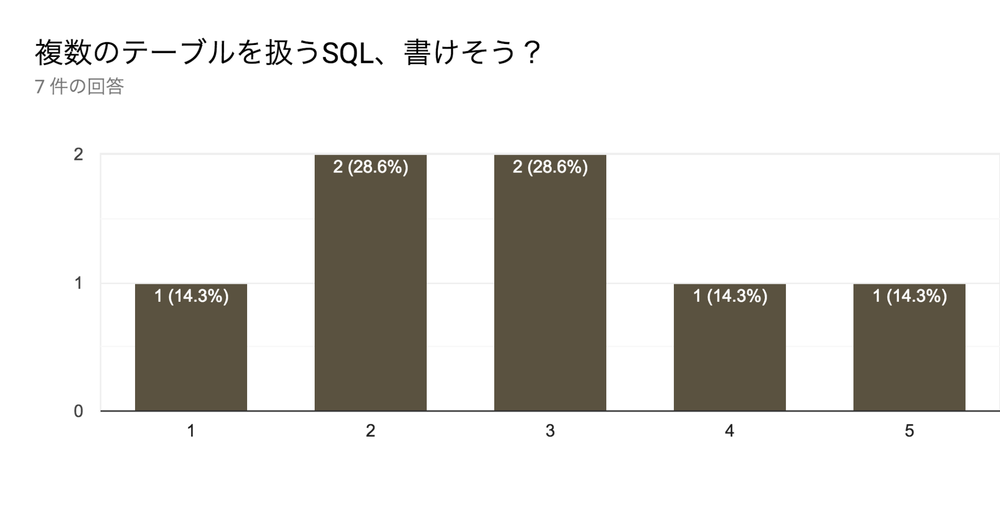
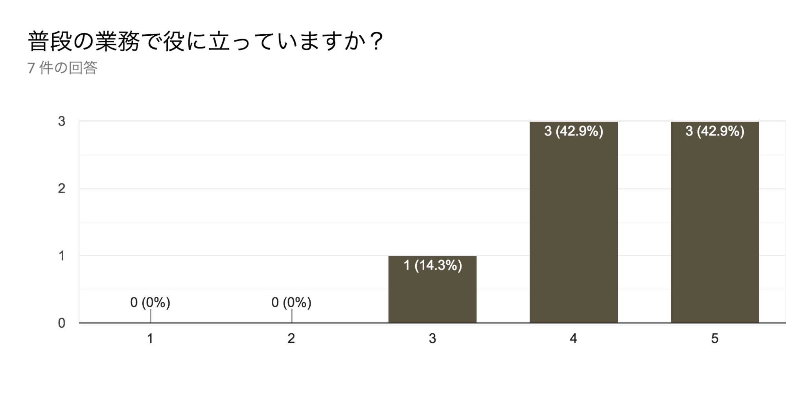
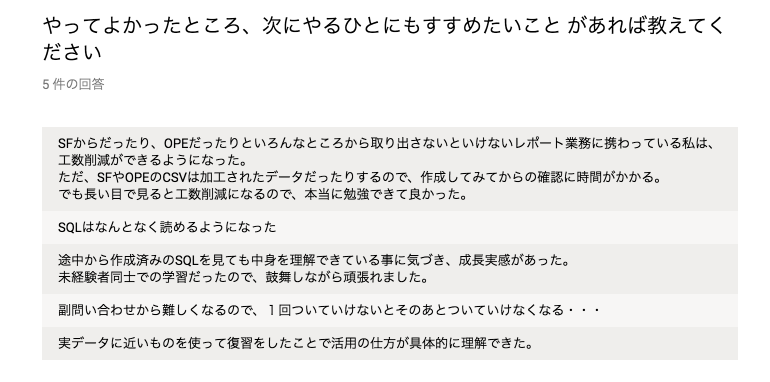
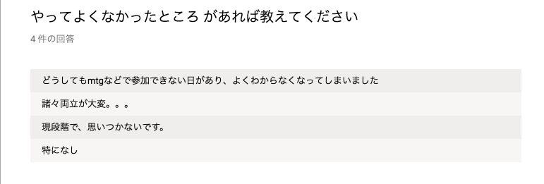
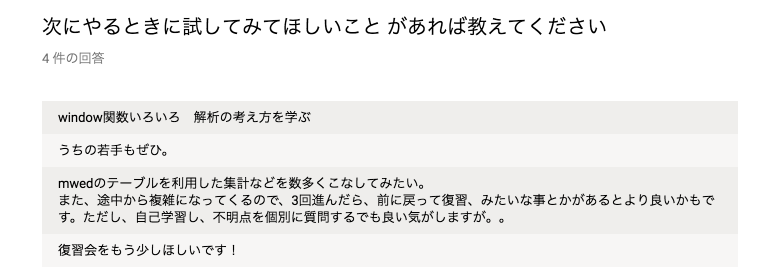
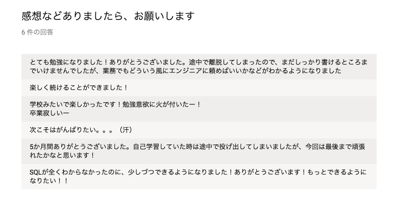
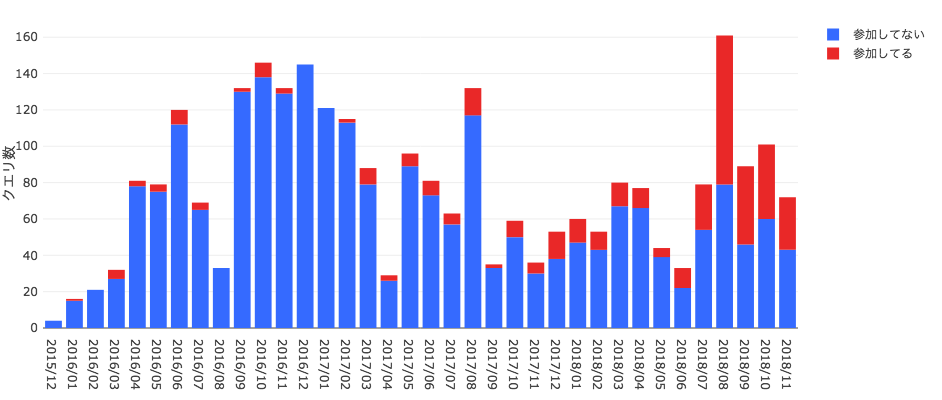

# ふりかえり

## アンケート

終わったあとにアンケートを取りました。
対象は参加してくれた全員で、7件戻ってきました。
中には途中で参加できなくなってしまったひとも含んでいます。

### 理解度

各セクションどれくらい理解できたか、5段階で訊きました。

セクション名の右にある小さいグラフがアンケート結果です。
セクション名に近いほうが「わからない」離れている方が「わかった」になっています。縦軸は人数です。

ひとつのテーブルを扱うところは…CASEを駆使するクロス集計と、集計とWHEREを組み合わせたりするところがまだ苦手そうです。

複数のテーブルを扱うところは…JOINがまだ苦手そうです。

まとめて答えてもらったのがこちらです。

ひとつのテーブルはだいたい大丈夫そう。
複数テーブルは…3〜5が4人もいるので、結構使えるひとが増えたといえると思います。

### その他

仕事で役に立っているか、と訊いたところ、6/7で役に立っているという回答でした。

勉強会を通して、よかったことを訊いたところ…。
業務で使って工数削減できそうとか、少なくともSQLを読めそう感が出てきたとか、実データを使ったのがよかったなどの声がありました。

ただ、ほかの業務との兼ね合いでなかなか難しい場合もありますね…。

解析の仕方を…これは「10年戦えるデータ分析入門」かな…

復習会…たしかにまたなにかしたい気持ちもあります…。

エンジニアにどういうふうに頼めばよいかわかった…これだけでもマジ仕事がラクになります…。

自己学習時は投げ出しちゃってたけど…そうそう、みんなでやるとよいですよね。やったかいがありました。

## redashの管理テーブルから

redashで管理用データベースも見れるようになっているので…参加者のクエリの作成数を活用度合いの指標として見てみました。

赤が参加者なのですが、急に増えているところがありますよね。
わりと勉強会を始めた直後くらいから参加者の保存しているクエリの数が増えてます。
しかもすごい量…。全体の作成数の半数近い…。

ちなみに自分はたくさん書く方ですが、参加者のほうに入れてないです。

ちゃんと事実として使ってくれているようで、本当に安心しました。

