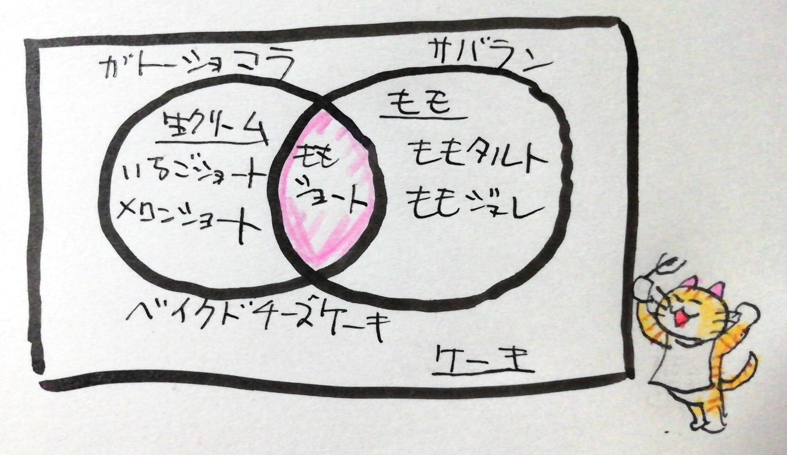
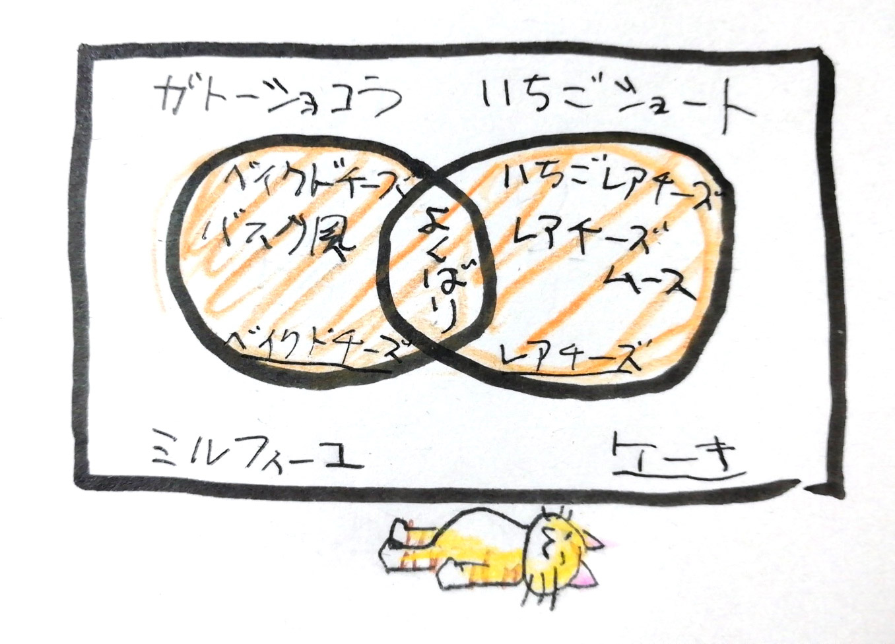
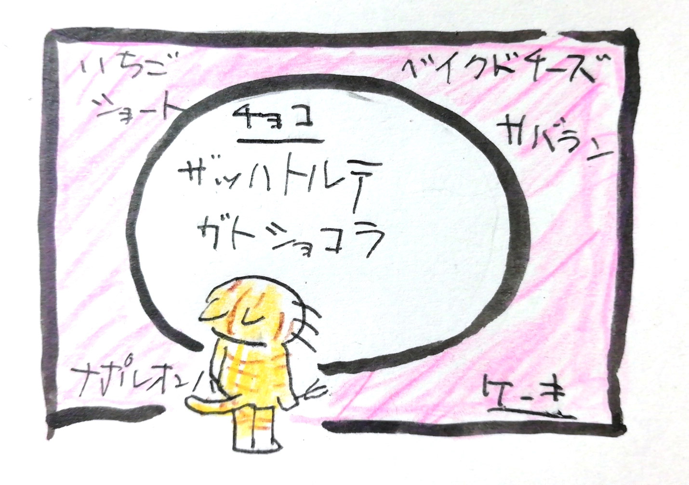

# 集合と論理演算

`WHERE`や`CASE`のところで、2つ以上の条件を書くときに`AND`を使ったと思います。
たぶんですが、少しピンと来ていないのではないかと思って、ちょっと補足します。

## どこでつかうの？

2つ以上の条件をつけるときに、実世界でどんなものがあるか考えてみます。

友達みんなで集まって遊ぶ約束をしたときに、あなたはケーキを持ってくる役割になりました。
友達から注文を取ると、このような感じでした。

1. 今ももが旬だよね。あと生クリームの気分だから、ももと生クリームが使われているケーキがいい！
2. めっちゃチーズ気分！ベイクドかレアで、うまそうに見えたほうを買ってきて！
3. 今日おやつにチョコレート食べちゃったから、チョコ系ケーキ以外で頼む！

## 種類

友達の注文をそれぞれ図に描いてみました。

### AND

> 1. 今ももが旬だよね。あと生クリームの気分だから、ももと生クリームが使われているケーキがいい！

1の友達は「生クリームが使われている」かつ(AND)「ももが使われている」ケーキであるものが食べたいといっているのです。
ももの乗ったカスタードクリームのタルトや、いちごのショートケーキを買っていくと、友達はがっかりするでしょう。もものショートケーキのようなものを探さねばなりません。

### OR

> 2. めっちゃチーズ気分！ベイクドかレアで、うまそうに見えたほうを買ってきて！

2の友達は「ベイクドチーズ」もしくは(OR)「レアチーズ」のケーキが食べたいと言っています。
ベイクドチーズケーキでもレアチーズケーキでも大丈夫そうです。もちろんベイクドアンドレアチーズのよくばりケーキでもよろこぶでしょう。

### NOT

3の友達は「チョコ」でない(NOT)ケーキを食べたいと言っています。
ガトーショコラやザッハトルテを買っていったら泣かれそうですが、イチゴショートでもベイクドチーズケーキでも、ナポレオンパイやサバランだってよろこんでもらえるでしょう。

## [ベン図](https://ja.wikipedia.org/wiki/%E3%83%99%E3%83%B3%E5%9B%B3)

これまで出てきた図ですが…感覚的にわかるでしょうか？
まるの中には同じタイプのケーキをグループとしてまとめていて、その外側にはその条件にあてはまらないものを置いています。
複数のタイプのときには、グループの重なりあいを見ながら、ほしいものがどういった条件のものであるのか、考えることができます。

この図を[ベン図](https://ja.wikipedia.org/wiki/%E3%83%99%E3%83%B3%E5%9B%B3)といいます。
普段の仕事の中でも、複雑な条件について話し合うときに、とても便利だと思います。

## 例題

### WHERE

### CASE
