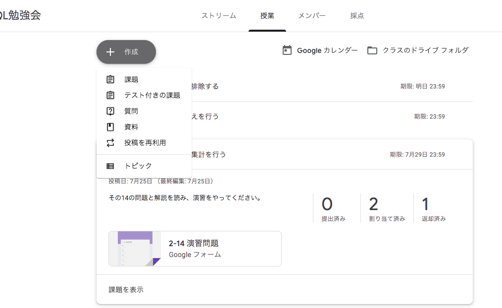
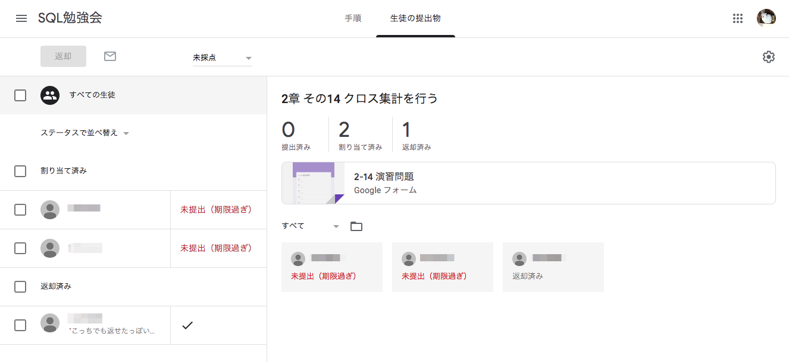

# Google Classroom

第2回を今やっているんですが、忙しいメンバーがほとんどでなかなか開催できずにいます。
そこで、自由な時間にやってもらって課題を提出してもらうタイプの方法を検討していました。
チャットツール上でやるのもよいのですが、特化したツールがないかと探してみつけたのが、
[Google Classroom](https://edu.google.com/intl/ja/products/classroom)です。

先生役が課題を作成し、生徒役が課題に回答して提出するというのが主な機能です。
課題にフィードバックをつけて返したり、それを再提出したり、課題についてチャットをしたりしながら、進めることができます。

ただし、こういったツールに不慣れな同僚たちも多く、今はうまく使えているとはいえません。パターンが見えてきたら、この本を改訂する際に追記したいと思っています。
