# はじめに

(moved)

---

## データ分析基盤とその普及

(moved)

---

# ニャーQL勉強会

ニャーQL勉強会とは、エンジニア以外のひとが集まって、SQLを書けるようになるための勉強会です。

ニャーQLっていうのは、参加者のひとりが言ってくれたフレーズで、自分で言いだしたわけじゃないんです。こういうキャッチーな言葉をサッと言えるようになりたいですねえ…。

# 教材

勉強会といっても、別にプロの講師でもなんでもないので、教材を持ってるわけじゃないです…。

ですので、うちの会社の書棚にあった[「改訂第3版 すらすらと手が動くようになる SQL書き方ドリル」](https://gihyo.jp/book/2016/978-4-7741-8066-3)を使うことにしました。
特徴として、SQLの簡単な解説と例題があり、それを使った演習問題をこなしながら進めていく点があります。

読むだけでなく、実際にSQLを書いて動かして結果を見れる点と、書く順序について書かれているので、非常に覚えやすそうでした。

`INSERT`や`UPDATE`、`CREATE TABLE`なども扱ってますが…。業務で扱えるのは、危険を伴わない`SELECT`だけと思い、ひとつのテーブルを扱う2章、複数のテーブルを扱う3章までにしました。

[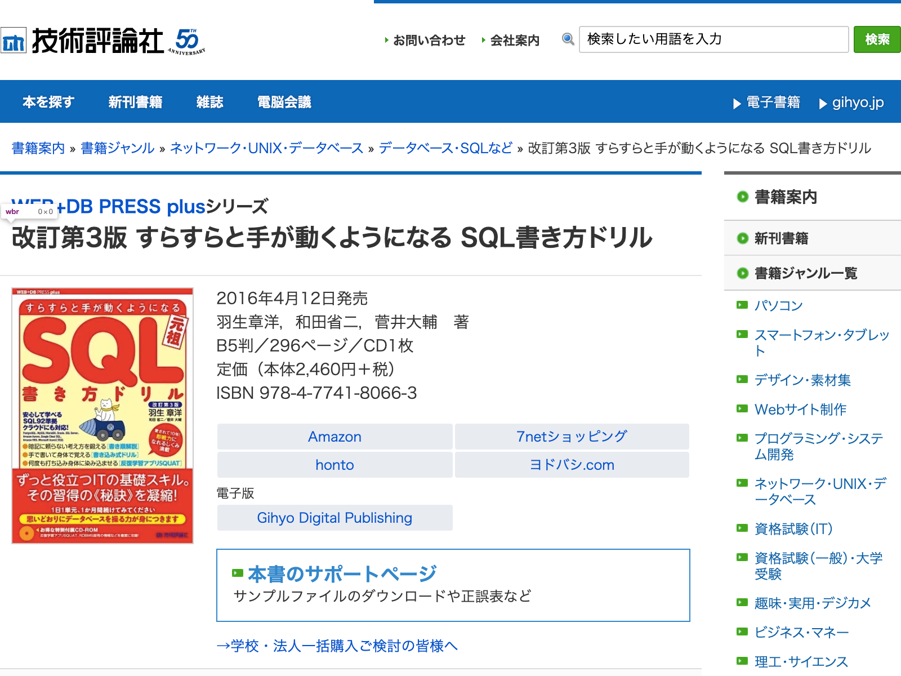](https://gihyo.jp/book/2016/978-4-7741-8066-3)

## 内容

本の目次から持ってきたんですが…小さくて見えないですよね。
なんとなく小さなステップを刻んでいく感じなのは…伝わりますか。
ひとつのテーブルを扱う2章は16セクション、複数のテーブルを扱う3章は10セクション。合計26セクションで構成されています。基本を覚えるところが手厚めです。

- 第2章ひとつのテーブルを扱う
  - その１　データを取り出す　顧客一覧を出してくれ
  - その２　複数の列を指定する　商品ごとの単価を出してくれ
  - その３　列に別名をつける　項目の名前がわからない
  - その４　列の値に対して演算を行う　税込価格で一覧を出してくれ
  - その５　列同士で演算を行う　社員の健康状態を一覧で出してくれ
  - その６　文字列の連結を行う　名札を作ってくれ
  - その７　集合関数を使う　平均を教えてくれ
  - その８　ある条件でレコードを絞り込む（1）　身長が大きな人を教えてくれ
  - その９　ある条件でレコードを絞り込む（2）　「〜子」という名前の人の人数を教えてくれ
  - コラム　「*」って何？
  - その10　列の値に条件を設定する　単価別にランク付けしてみてくれ
  - その11　グループ単位で集計する　都道府県別の顧客数を教えてくれ
  - その12　グループ単位で集計した結果を絞り込む（1）　顧客数が3人以上の都道府県を教えてくれ
  - その13　グループ単位で集計した結果を絞り込む（2）　法人客の数が2人以上の都道府県を教えてくれ
  - その14　クロス集計を行う　社員の血液型別の人数ってどうなってるんだろう
  - その15　並び替えを行う　単価の安い順に商品名を出してくれ
  - その16　重複を排除する　住所一覧を出してくれ
- 第3章複数のテーブルを扱う
  - 特別講義（1）　結合とは　ここから先に進む前に！
  - その１　副問い合わせを使う　販売数量がゼロの商品を教えてくれ
  - 特別講義（2）　テーブルに別名をつける　ここから先に進む前に！
  - その２　複数テーブルの結合を行う（1）　再び都道府県別の顧客数を教えてくれ
  - その３　複数テーブルの結合を行う（2）　部門別の平均給与額を教えてくれ
  - コラム　名前付きSELECT文としてのビュー
  - その４　外部結合を使う　全部の商品の平均販売単価を教えてくれ
  - その５　自己結合を使う　セット商品の候補を考えてくれ
  - その６　相関副問い合わせを使う　商品別の平均販売数量よりも多く売れている日を教えてくれ
  - 特別講義（3）　集合演算とは　ここから先に進む前に！
  - その７　UNION ALLを使う　顧客と社員の名前一覧を出してくれ
  - その８　UNIONを使う　重複のない顧客・社員の名前一覧にしてくれ
  - その９　INTERSECTを使う　給料日に販売をした社員の一覧を出してくれ
  - その10　EXCEPTを使う　販売をしたことがない社員の一覧を出してくれ

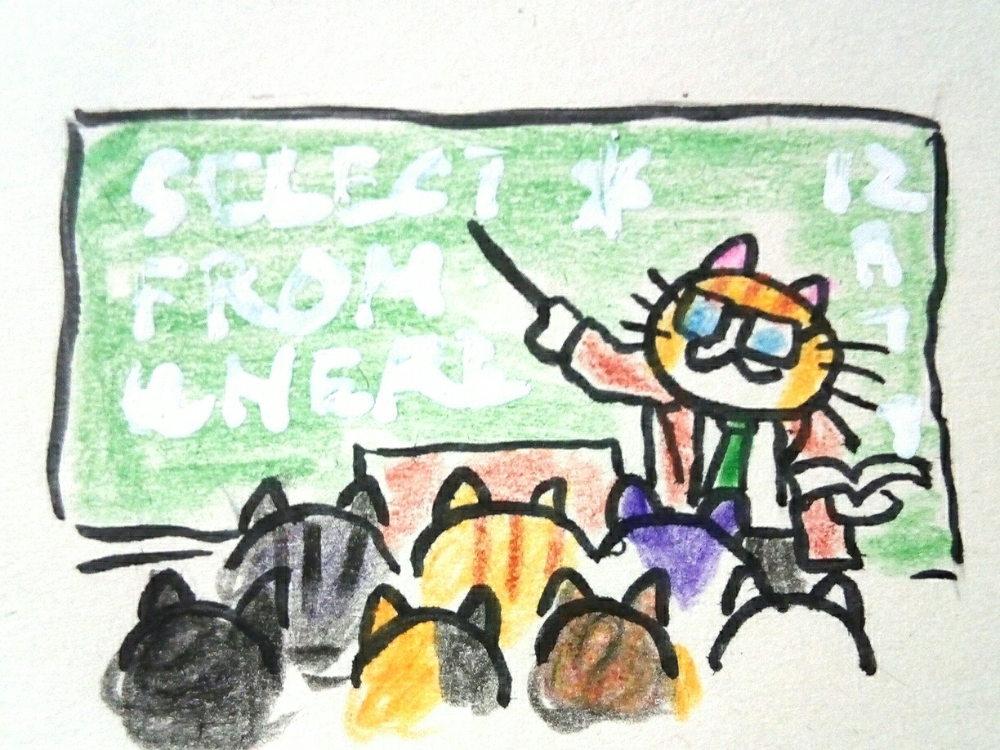

### よいところ

この本の何より素晴らしいところは、サンプルデータベースがねこであることです。
単に自分がねこ好きだからというだけでなく、勉強の教材として見た目だけでも柔らかく簡単に見えそうなことが、参加者に第一歩を踏み出してもらうために重要だと感じています。

それから、学習を小さな単位で繰り返し徐々に覚えていく、ドリル形式であることもとてもよいです。
確実にできることが増えていっていることが実感できると思います。

また、この本の最大のウリである、書き順も素晴らしいです。
考える順に従っているので、とてもよいと思います。
ただ…クエリを一気に組み立てるように書かれており、そのままやるとtypoで苦しむので、少しずつ組み立てるように今は教えています。

- サンプルデータベースがねこ
- ドリル形式
- 書き順が書いてあること

### おしいところ

この本には惜しいところがあって、問題や解答がまちがっているところがあります。
教科書は絶対だ！と信じてやってしまうと、気づかずにスルーしてしまいます。
勉強会では、自分が見ているので、そういったところには説明をいれています。
（ひとりでやる場合には、鵜呑みにしないことと、検算をすることが大事になりそうです。）

- 問題や解答がまちがってるとこがある

# 当初の形式

毎朝 9:30 から 30分、事前に予習してきたことについて、わからないことを訊いてもらったり、演習問題の回答を前で発表したりする形にしました。
期間はあまり長くなってしまうとみんな続かなくなってしまいそうなので短めにしたく…
でも、26セクションもあって、数を見ると26セクション、毎日1〜2セクションで進んでも1ヶ月半から2ヶ月程度掛かりそうな予定でした。

- 毎朝 9:30 〜 10:00
  - 事前に予習してくる
  - 例題、解説を読む
- 演習問題をやってくる
- 勉強会中にわからなかったことを訊く
- 解いてきた演習問題を前で発表する
- 1セクションあたり、1〜2回でやると、1ヶ月半〜2ヶ月程度かかる。
  - 長くなると続かないような気がしたので、あまり終わらないときには切り上げて次に進む感じで…。
- 参加者は5人→10人（途中で増えました）

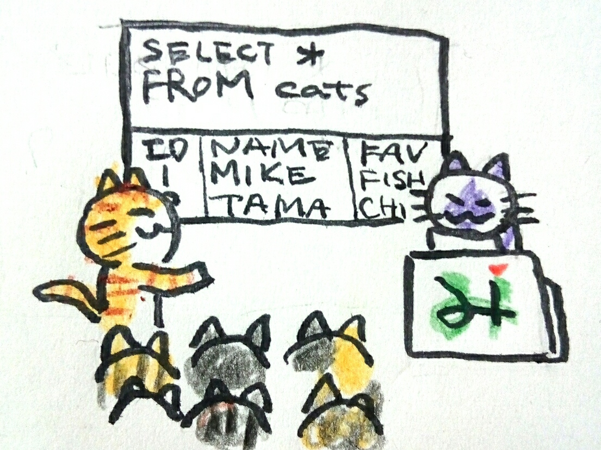

## 予習・発表の形式にしたねらい

少しハードルが高くなってしまうのはわかっていましたが、勉強会の形式を予習・発表の形式にしたのには狙いがありました。
予習でやってもらう演習は実際に手を動かしてもらい、体で感じてほしいという思いでした。
回答を前で発表する形式をとったのは、予習をやってきたひとに活躍の場を作りたかったことと…
発表を見ているひとは、自分と同じ立場のひとが解いていることを目の当たりにすれば、自分にもできる！と思えるかと思ったのでした。

- デメリット
  - 参加ハードルが上がってしまう
- メリット
  - 聴くだけでなく、手を動かしてほしい
  - 発表することで、キチンとやってきたことをみんなでほめたい
  - 発表できなかったひとも、同じ立場のひとが解いた事実から
  - 自分もできそうだと思えそう

# 参加者がつまづいたところ

始める前に、`WHERE`、`COUNT`や`SUM`などの集計、複数テーブルをつなげる`JOIN`あたりはつまづきそうと想定していましたが…

- WHERE
- 集計
- JOIN
- UNION

実際に始めてみると…
整数の演算結果と実数の演算結果の違うこと…
実データに出てくるUNIX時間と日付やタイムスタンプへの相互変換、当然タイムゾーンなんかもでてきます。
日付の変換がいくつも関数を入れ子にするんですが、この関数の入れ子自体も苦手だったりもしました。
人類にはまだ早い、NULLと0の差だったり…。
カラムの横持ちのときにCASEの条件をちゃんとするのが難しかったり、(ドリルも間違えていた…。)
副問合せ…他の方法で解決できることもあるものですから、なかなか使わないですね…自分もですが。

- 整数と実数の演算結果の差
- 日付、タイムスタンプ、UNIX時間の間の変換、タイムゾーン
- 関数の入れ子が苦手
- NULLと0
- カラムの横持ちのときのCASE
- 副問合せ

こんな感じで結構でてきて…どうしたものかと頭をなやませました。

---

# くふう

# スケジュールどおりを諦めた

たくさんつまづくポイントがあるということは、理解の浅くなるセクションが多くなってしまうということで…。結果、SQLを実践で使えないままの可能性も高くなってしまう…。ということは…エンジニアから仕事を渡せないということになってしまいます。

一方で勉強会中の参加者の様子を観察していたのですが、「使えるようになりたい」という気持ちが強そうで、勉強会の期間が延びてしまっても続けてがんばりそうな感じに見受けられました。

ですので…自分も覚悟し…。
スケジュールどおりに進めるのは諦め、各セクションで参加者の誰かが演習問題をちゃんと解けることがわかるまで終わらない、つまりとことん付き合っていくことを決めました。

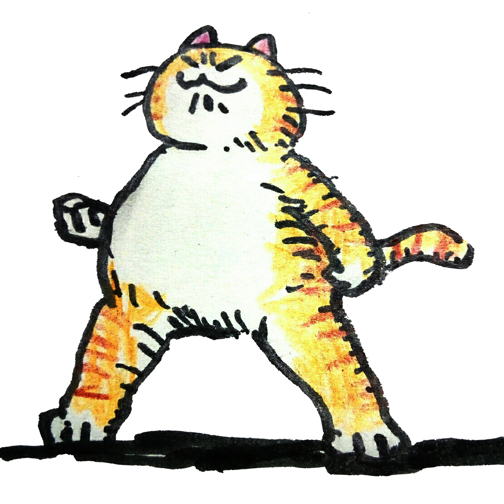

# 参加意欲に関するくふう

むずかしくなってきて、少しヘコみ気味なように見えました。
少し楽しさを持たせて、勉強会を続ける気持ちを後押ししたかったので…。

- 発表シール
  - 演習問題の回答を前で発表してくれたひとに
  - 金色のシールをプレゼント
- 出席シール
  - 勉強会に出席したひとに
  - 銀色の小さいシールをプレゼント

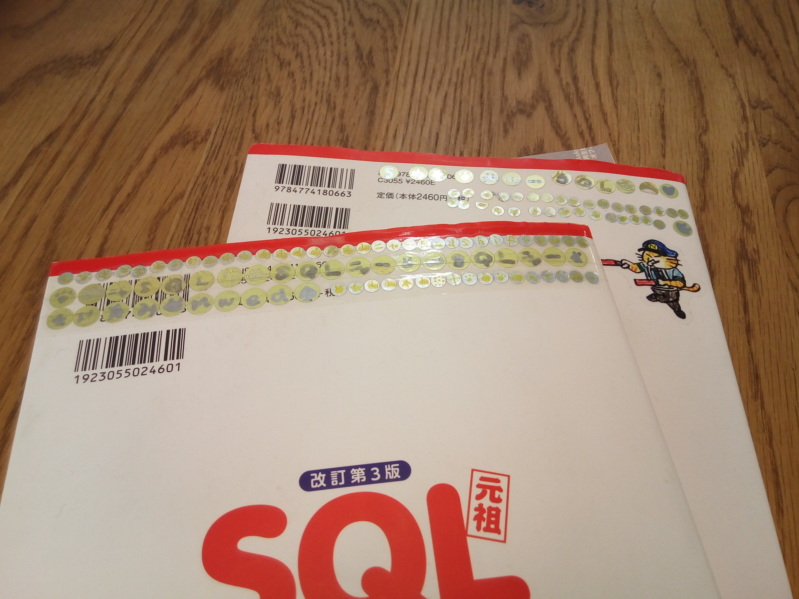

予習してきた演習問題を発表してくれたら金のシールをプレゼント。
勉強会に参加したら、金のシールより小さい銀のシールをプレゼント。

実はシールの色はこだわりました。シール自体は普通のものですが、金や銀だと、青とか赤とかの普通の色よりなんか特別あるでしょ？

プレゼントしたら、写真のように、みんなドリルに貼ってくれました。やってる感がめっちゃ出てませんか？

# 解き方に関するくふう

解き方についても少し工夫しました。

## 自分が仕事で書いたクエリをシェア

仕事で実際に頼まれて書いたときに、みんなが読んでわかりそうなときにはシェアするようにしました。サンプルのなまなましさや、ちょっとした書き方のコツを伝えたかった感じです。

- 誰かが使っているものというと生々しいでしょ？
- SELECTで出すときにいろいろしたりするし…
- そういうところを見て、ちょっとしたコツを掴んでもらえれば…。

## 例題のライブコーディング

ドリルは書き順が書かれているんですが、試行錯誤的なことをせずに一気に書き上げてます。前で演習問題を書いている様子を見てると、大きなクエリを一気に書いたはいいが、どこかまちがってて動かず…間違いを探せずに困ってることもよくありました。実際にはそんなに一気に書くことはしないですよね。小さい部分に分けてそれぞれを完成させてからつなぎ合わせて作りませんか？そういったことを伝えたくて、例題を普段のように回答して見せました。
こういうのマヂ苦手なんですけどね…。

- ドリルは書き順があってよいのですが、一回で書き上げています。
- 参加者も同じように一回で書こうとして、エラーで困ったりしてました…。
- ホントは一回で書かないですよね？
- 普段自分が書く雰囲気を伝えたかったので、試行錯誤しながら解いていく様子を見せました。

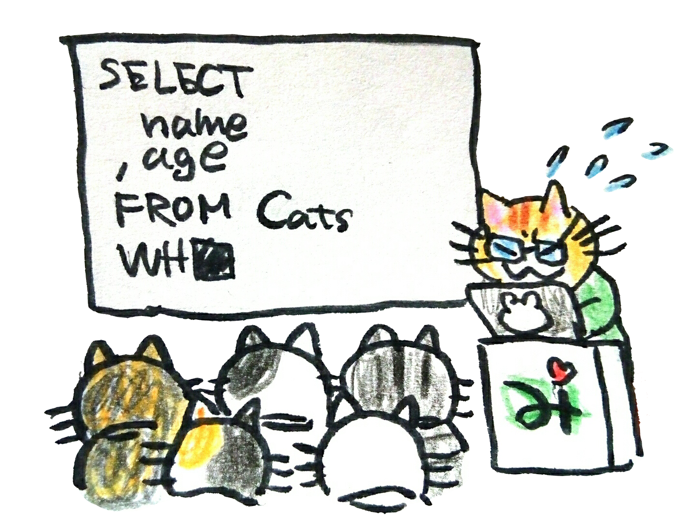

## ベン図の紹介

エンジニア以外のひとたちは集合や論理演算に慣れていません。`WHERE`で`AND`や`OR`を使うところで少し違和感を感じていて、`UNION`であっと気づいて…。イメージで補助するツールとしてベン図を紹介しました。

- エンジニア以外のひとたちは集合や論理演算に慣れていません
- `WHERE`のところで`AND`や`OR`を使うところで違和感を感じ…`UNION`で気づきました。
- イメージで補助するツールとして紹介しました。

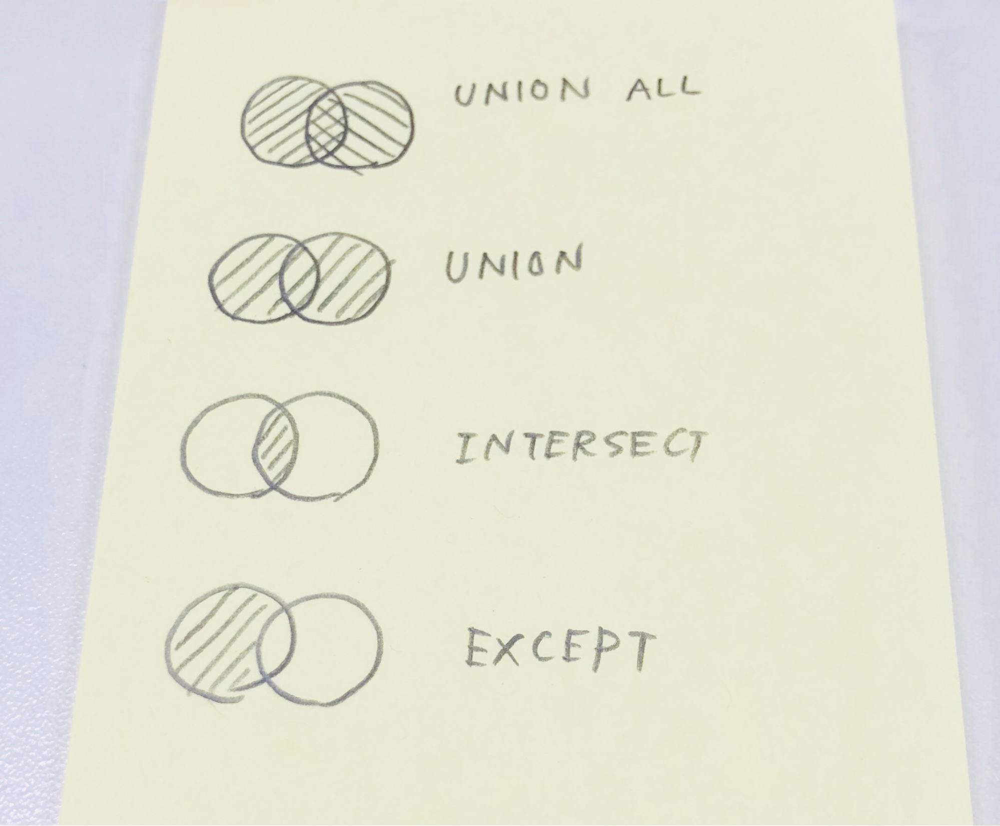

## テーブル関連図をみんなで描いてもらう

それから、複数のテーブルをJOINして使うところを終わり近くまでうまく飲み込めてなかったようでしたので、テーブルの関連図をみんなで描きました。みんななるほどーという顔をしていました…。もう少し早く思いつけばよかったんですが、まあ仕方なし…。
同じようなことをされる方は、複数テーブルを扱う前に一度やってみるとよさそうです。

- JOINがなかなか飲み込めてなさそうでした。
- 実際に線をひっぱってもらいました。

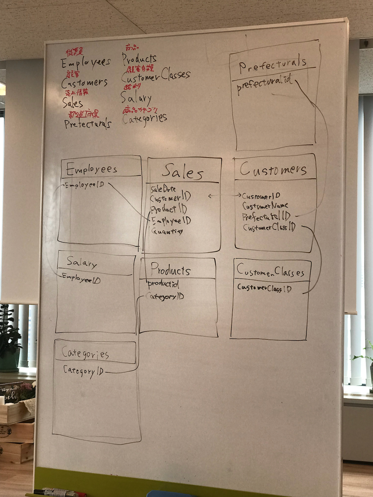

# 復習に関するくふう

## 分析用データベースを使った復習問題

問題がなかなかむずかしくなってきて、理解がまだ浅めに見えました。うちの会社は分析用のデータベースが誰でも使える状態にあるので、ここから復習用問題をセクションが終わるごとに出すようにしました。仕事にすぐ活かせそうなこともあって、みんな真剣にやってくれました。

- 次のセクションの前に、前回の復習を出しました
- 分析用のデータベースを使ったので、仕事にすぐ活かせそうで、やる気が湧いていた。

## 章末で参加者同士で作った復習問題

章が終わったタイミングで、みんなに分析用データベースを使って、お互いに復習問題を作って、解いてもらいました。
もちろん、解ける問題を作ってもらうので、復習必須、身の入りようがちがうでしょ？

- 章が終わったタイミングでやりました。
- 分析用のデータベースを使ってお互いに出してもらう形式です。
- 出題者が解答も準備してもらうので、復習必須。
- ひとに問題を出すのって、身の入り方が違うでしょ

## 実際に掛かった時間

実際に掛かった時間ですが…
7月4日から始めて…

WHEREを実データを使った例を加えてやったので少し長くなって…
単一テーブルを扱う2章が終わったのが8月17日、その後3回みんなで出し合った復習問題をやって…

8月27日から3章に入り…。

外部結合で少し苦戦してますね。

相関副問合せも苦労しています。

3章も終わりになってようやくテーブルの関連を書くことに気づきました

10月16日からまたみんなで出しあう復習問題が…できることが増えて難問続出で…一ヶ月くらいやってました。

最後に自由な質問や、redashでグラフを描いたりしていました。
5ヶ月くらいやっていたんですねえ…。

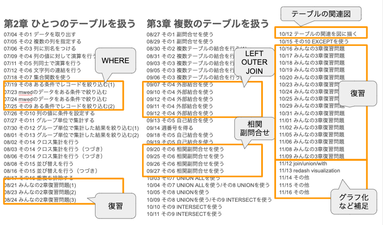

# 打ち上げに関するくふう

みんな長い時間をかけてがんばってきたんですから、打ち上げもしました。
ここも少し遊びを入れています。

## 卒業シール

趣味のシールづくりを活かして、卒業シールをあげました。
金色のペンでニャーQLと手書きで入れてあります。ドリルに貼ってくれると、終わった感が出ますよねえ。

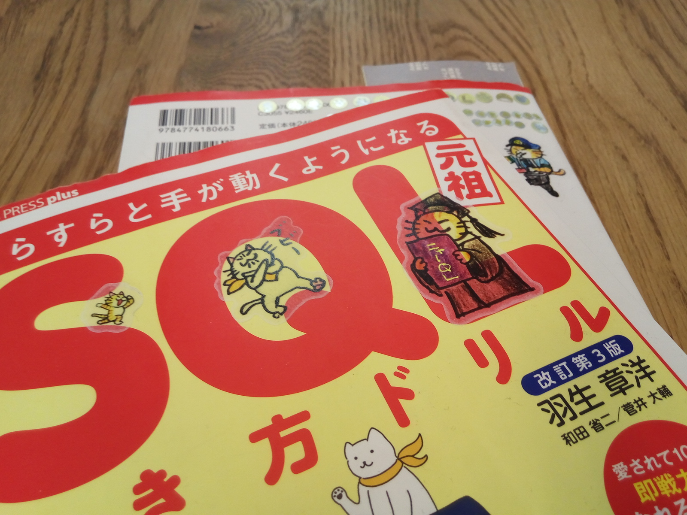

## 打ち上げランチ

卒業ランチと称して、みんなでちょっと高いお弁当を買ってきてランチ会をしました。
個人的におすすめしたいのは、ノンアルコールのスパークリングワイン。
特別感が出せます。

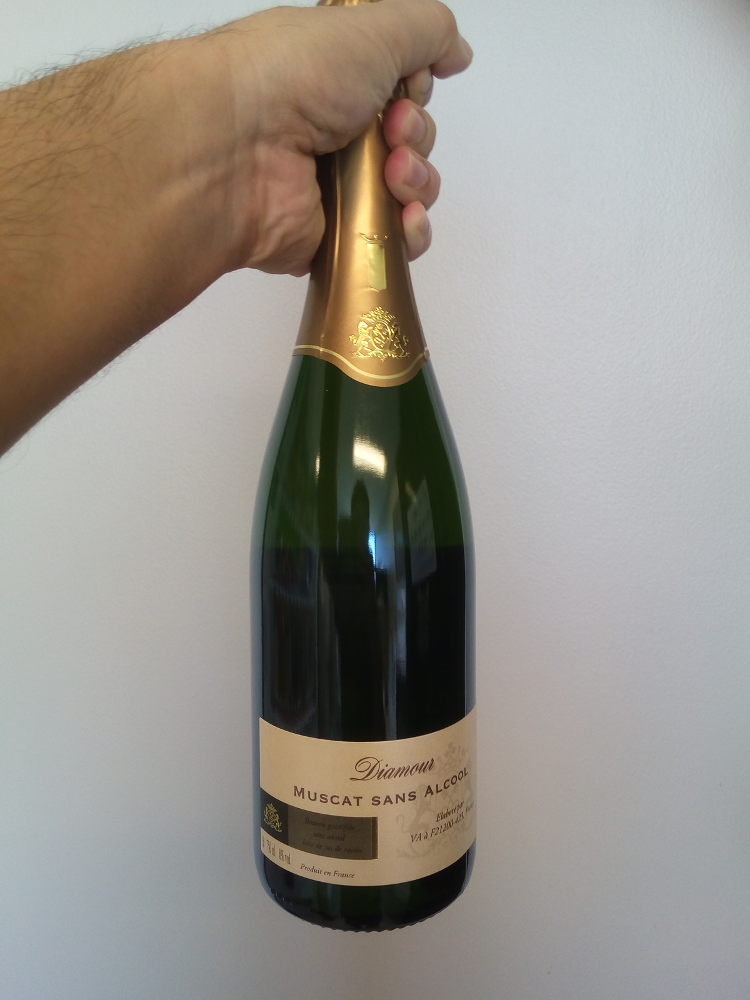

---

# おわってみて

# アンケート

終わったあとにアンケートを取りました。
対象は参加してくれた全員で、7件戻ってきました。
中には途中で参加できなくなってしまったひとも含んでいます。

## 理解度

各セクションどれくらい理解できたか、5段階で訊きました。

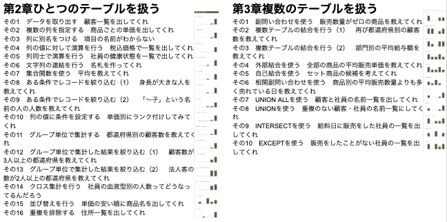

セクション名の右にある小さいグラフがアンケート結果です。
セクション名に近いほうが「わからない」離れている方が「わかった」になっています。縦軸は人数です。

ひとつのテーブルを扱うところは…CASEを駆使するクロス集計と、集計とWHEREを組み合わせたりするところがまだ苦手そうです。

複数のテーブルを扱うところは…JOINがまだ苦手そうです。

まとめて答えてもらったのがこちらです。

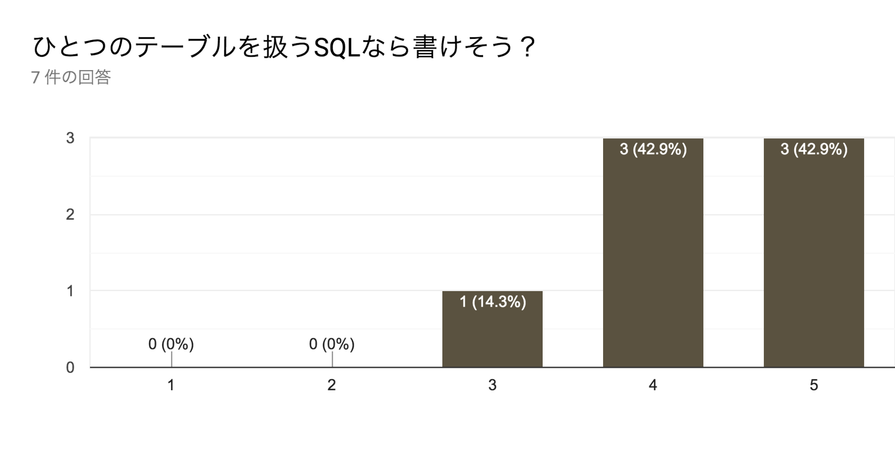
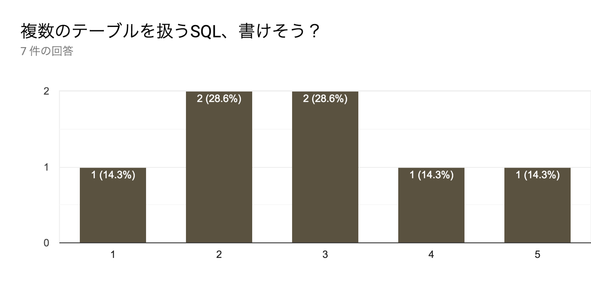

ひとつのテーブルはだいたい大丈夫そう。
複数テーブルは…3〜5が4人もいるので、結構使えるひとが増えたといえると思います。

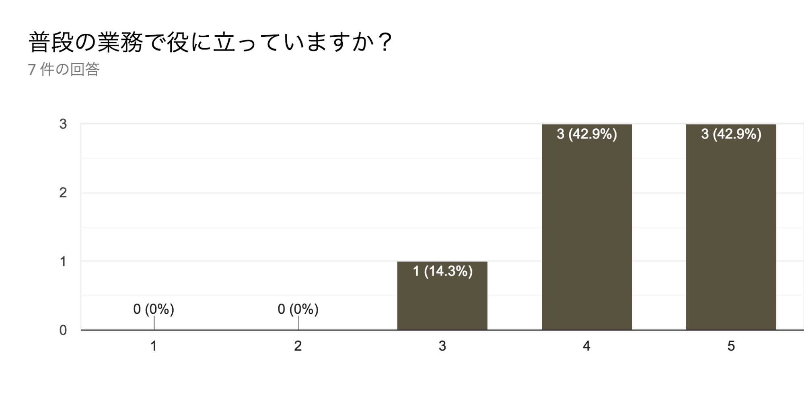

## その他

仕事で役に立っているか、と訊いたところ、6/7で役に立っているという回答でした。

勉強会を通して、よかったことを訊いたところ…。
業務で使って工数削減できそうとか、少なくともSQLを読めそう感が出てきたとか、実データを使ったのがよかったなどの声がありました。

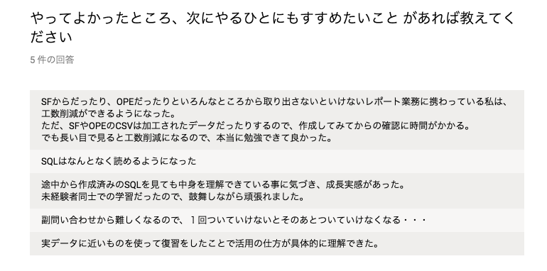

ただ、ほかの業務との兼ね合いでなかなか難しい場合もありますね…。

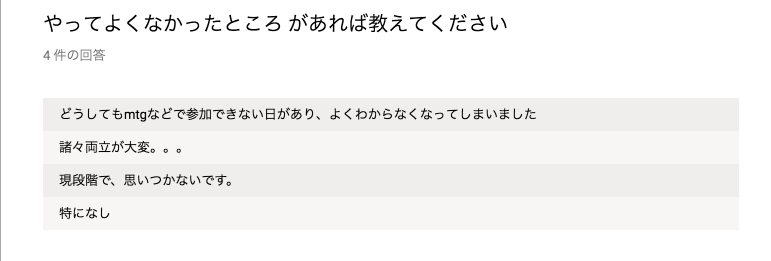

解析の仕方を…これは「10年戦えるデータ分析入門」かな…

復習会…たしかにまたなにかしたい気持ちもあります…。

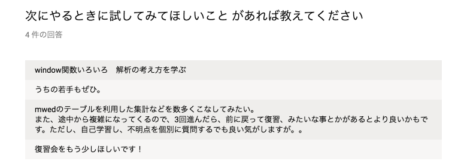

エンジニアにどういうふうに頼めばよいかわかった…これだけでもマジ仕事がラクになります…。

自己学習時は投げ出しちゃってたけど…そうそう、みんなでやるとよいですよね。やったかいがありました。

## redashの管理テーブルから

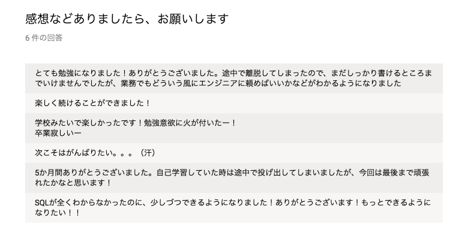

redashで管理用データベースも見れるようになっているので…参加者のクエリの作成数を活用度合いの指標として見てみました。

赤が参加者なのですが、急に増えているところがありますよね。
わりと勉強会を始めた直後くらいから参加者の保存しているクエリの数が増えてます。
しかもすごい量…。全体の作成数の半数近い…。

ちなみに自分はたくさん書く方ですが、参加者のほうに入れてないです。

ちゃんと事実として使ってくれているようで、本当に安心しました。

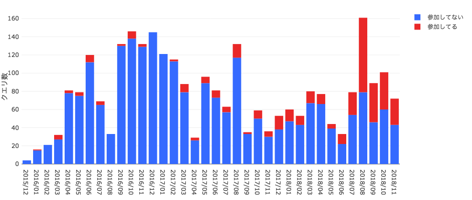

# まとめ

自分でデータを活用したいひとはめっちゃたくさんいます。
でも、自在に取り出すためにはSQLがハードルで…各々学習するのに二の足を踏んでるひとも多いです。
勉強会のように場を用意し、サポートすればやるひとは多いと思います。
ただ、地がエンジニアでないので慣れてないことも多々あり、長期間になるのは覚悟したほうがいいです。
そのかわり、得るものは大きいと思います。今回の勉強会の参加者は本当に活用しています。

ぜひ、みなさんもエンジニアでない人たちのSQLの勉強のサポートをして、自分の手を使わずに業務改善をしてもらったり、データ分析をしてもらったりしてください！
