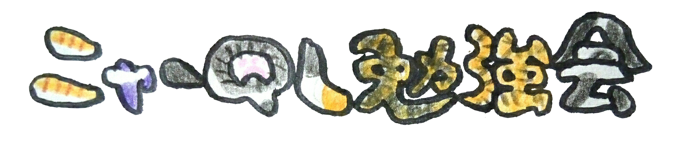

# はじめに

まあ、まずみてください。SQLなんですよ。


小さいんですが、よーく目を凝らして見ていただくとですね、CASEやらJOINやらいろいろ使っているのがわかるかと思います。わからなくても、雰囲気くらい感じられますかねえ…。

これらのクエリは、エンジニアじゃない同僚たちが自分で作って、使っているものです。


この本では、エンジニアじゃない同僚たちとやった、SQLの勉強会について書いていこうと思います。


# データ分析基盤の普及

みんなのウェディングには、データ分析基盤として、サービスで使っているデータベースの内容や、アクセスログその他もろもろをRedshiftに分析用データベースとして集めていて、だれでも分析したりシェアしたりしやすいようにRedashを置いています。整備したのは 2016年くらいです。[ブログ](https://blog.mwed.info/posts/wedding-dwh-status-2016-06.html)もあるので、細かいことはそちらをみてください。
最初はエンジニアやごく少数のエンジニア以外でSQLを使えるひとが使っていました。便利さや誰でも使えるということが伝わってきたようで、SQLに興味を持つひとがちらほらでてきました。ただ、自分で始めるようとするには少しハードルが高そうでした…。

```text
2016年ごろ、誰でも使えるデータ分析基盤が整備
  ↓
エンジニアやごく少数のエンジニア以外でSQLを使えるひとだけが利用
  ↓
便利さやだれでも使えることが馴染んできた
  ↓
SQLに興味を持つひとが増えてきたが、どうやって学んだらよいかわからない
```

# 背中を押した

以前はよく、データの分析をしたいのでデータをまとめて出してほしい、ということをよくエンジニアが頼まれていました。データを出してから条件を調整したいので出し直してといわれることもしばしば。しかも、一度で済むわけもありません。何度も何度も出し直し、時間がかかっていました。

そこに持ち込まれる内容で、分析用データベースにある情報だけでわかる内容もぼちぼちありました。
もしかして、みんなにSQLを使えるようになってもらったら、俺たち、仕事ラクになるんじゃ？
そんなハッピーな未来を妄想して、二の足を踏んでる同僚達の背中を押すべく…
「みんなで集まってSQLの勉強会やろうよ。困ったら手助けするからさ！」
こんなふうに言ったら、始まったのでした。

```text
データの分析をしたいので抽出してほしいという依頼がよくあった。
調整後抽出し直しもしばしば。
  ↓
それぞれでSQLが使えるように手助けしたら、仕事がラクになりそう
  ↓
みんなで勉強しましょう。わからないところは教えますから！
```


---

# ニャーQL勉強会

ニャーQL勉強会とは、エンジニア以外のひとが集まって、SQLを書けるようになるための勉強会です。

ニャーQLっていうのは、参加者のひとりが言ってくれたフレーズで、自分で言いだしたわけじゃないんです。こういうキャッチーな言葉をサッと言えるようになりたいですねえ…。



# 教材

勉強会といっても、別にプロの講師でもなんでもないので、教材を持ってるわけじゃないです…。

ですので、弊社の書棚にあったこの本を使うことにしました。
特徴として、SQLの簡単な解説と例題があり、それを使った演習問題をこなしながら進めていく点があります。

読むだけでなく、実際にSQLを書いて動かして結果を見れる点と、書く順序について書かれているので、非常に覚えやすそうでした。

INSERTやUPDATE、CREATE TABLEなども扱ってますが…。業務で扱えるのは、危険を伴わないSELECTだけと思い、ひとつのテーブルを扱う2章、複数のテーブルを扱う3章までにしました。


## 内容

本の目次から持ってきたんですが…小さくて見えないですよね。
なんとなく小さなステップを刻んでいく感じなのは…伝わりますか。
ひとつのテーブルを扱う2章は16セクション、複数のテーブルを扱う3章は10セクション。合計26セクションで構成されています。基本を覚えるところが手厚めです。

- 第2章ひとつのテーブルを扱う
  - その１　データを取り出す　顧客一覧を出してくれ
  - その２　複数の列を指定する　商品ごとの単価を出してくれ
  - その３　列に別名をつける　項目の名前がわからない
  - その４　列の値に対して演算を行う　税込価格で一覧を出してくれ
  - その５　列同士で演算を行う　社員の健康状態を一覧で出してくれ
  - その６　文字列の連結を行う　名札を作ってくれ
  - その７　集合関数を使う　平均を教えてくれ
  - その８　ある条件でレコードを絞り込む（1）　身長が大きな人を教えてくれ
  - その９　ある条件でレコードを絞り込む（2）　「〜子」という名前の人の人数を教えてくれ
  - コラム　「*」って何？
  - その10　列の値に条件を設定する　単価別にランク付けしてみてくれ
  - その11　グループ単位で集計する　都道府県別の顧客数を教えてくれ
  - その12　グループ単位で集計した結果を絞り込む（1）　顧客数が3人以上の都道府県を教えてくれ
  - その13　グループ単位で集計した結果を絞り込む（2）　法人客の数が2人以上の都道府県を教えてくれ
  - その14　クロス集計を行う　社員の血液型別の人数ってどうなってるんだろう
  - その15　並び替えを行う　単価の安い順に商品名を出してくれ
  - その16　重複を排除する　住所一覧を出してくれ
- 第3章複数のテーブルを扱う
  - 特別講義（1）　結合とは　ここから先に進む前に！
  - その１　副問い合わせを使う　販売数量がゼロの商品を教えてくれ
  - 特別講義（2）　テーブルに別名をつける　ここから先に進む前に！
  - その２　複数テーブルの結合を行う（1）　再び都道府県別の顧客数を教えてくれ
  - その３　複数テーブルの結合を行う（2）　部門別の平均給与額を教えてくれ
  - コラム　名前付きSELECT文としてのビュー
  - その４　外部結合を使う　全部の商品の平均販売単価を教えてくれ
  - その５　自己結合を使う　セット商品の候補を考えてくれ
  - その６　相関副問い合わせを使う　商品別の平均販売数量よりも多く売れている日を教えてくれ
  - 特別講義（3）　集合演算とは　ここから先に進む前に！
  - その７　UNION ALLを使う　顧客と社員の名前一覧を出してくれ
  - その８　UNIONを使う　重複のない顧客・社員の名前一覧にしてくれ
  - その９　INTERSECTを使う　給料日に販売をした社員の一覧を出してくれ
  - その10　EXCEPTを使う　販売をしたことがない社員の一覧を出してくれ


## よいところ

(TODO)

- サンプルデータベースがねこ
- ドリル形式
- 書き順が書いてあること


## おしいところ

(TODO)

- 問題や解答がまちがってるとこがある

## 向く人向かない人

(TODO)

本に書いてあることが絶対正しいと思い込んでいる人には薦められませんが…
自分がトレーナーとしてつくので問題ありません。

# 形式

やり方なんですが…。
毎朝 9:30 から 30分、事前に予習してきたことについて、わからないことを訊いてもらったり、演習問題の回答を前で発表したりする形にしました。
期間はあまり長くなってしまうとみんな続かなくなってしまいそうなので短めにしたく…
でも、26セクションもあって、数を見ると26セクション、毎日1〜2セクションで進んでも1ヶ月半から2ヶ月程度掛かりそうな予定でした。

- 毎朝 9:30 〜 10:00
  - 事前に予習してくる
  - 例題、解説を読む
- 演習問題をやってくる
- 勉強会中にわからなかったことを訊く
- 解いてきた演習問題を前で発表する
- 1セクションあたり、1〜2回でやると、1ヶ月半〜2ヶ月程度かかる。
  - 長くなると続かないような気がしたので、あまり終わらないときには切り上げて次に進む感じで…。
- 参加者は5人→10人（途中で増えました）


# 予習・発表の形式にしたねらい

少しハードルが高くなってしまうのはわかっていたのですが、勉強会の形式を、予習・発表の形式にしたのには狙いがありまして…
予習でやってもらう演習は実際に手を動かしてもらって、体で感じてほしくって…
回答を前で発表する形式をとったのは、予習をやってきたひとに活躍の場を作りたかったことと…
発表を見ているひとは、自分と同じ立場のひとが解いているんだと思えば、自分にもできる！と思えるかと思ったのでした。

- デメリット
  - 参加ハードルが上がってしまう
- メリット
  - 聴くだけでなく、手を動かしてほしい
  - 発表することで、キチンとやってきたことをみんなでほめたい
  - 発表できなかったひとも、同じ立場のひとが解いた事実から
  - 自分もできそうだと思えそう


# 参加者がつまづいたところ

始める前になんとなく、WHERE、COUNTやSUMなどの集計、複数テーブルをつなげるJOINあたりはつまづきそうと思っていたのですが…

- WHERE
- 集計
- JOIN
- UNION

実際に始めてみると…
Redshiftきびしいな、整数の演算結果と実数の演算結果の違い、うちがUNIX時間で記録しているデータもあるからイケナイんですが、実データを扱うときに日付やタイムスタンプへの相互変換があったり、当然タイムゾーンなんかもでてきます…
日付の変換がいくつも関数を入れ子にするんですが、この関数の入れ子自体も苦手だったり、あるあるのNULLと0の差だったり…
これ、ドリルについてた解答も間違ってたんですが、カラムの横持ちのときにCASEの条件をちゃんとするのが難しかったり、
副問合せ…他の方法で解決できることもあるものですから、なかなか使わないですね…自分もですが。

- 整数と実数の演算結果の差
- 日付、タイムスタンプ、UNIX時間の間の変換、タイムゾーン
- 関数の入れ子が苦手
- NULLと0
- カラムの横持ちのときのCASE
- 副問合せ

こんな感じで結構でてきて…どうしたものかと頭をなやませました。

# とことん付き合うことにした

たくさんつまづくポイントがあるということは、理解の浅くなるセクションが多くなってしまうということで…。結果、SQLを実践で使えないままの可能性も高くなってしまう…。ということは…エンジニアから仕事を渡せないということになってしまいます。

一方で勉強会中の参加者の様子を観察していたのですが、「使えるようになりたい」という気持ちが強そうで、勉強会の期間が延びてしまっても続けてがんばりそうな感じに見受けられました。

ですので…自分も覚悟し…。
スケジュールどおりに進めるのは諦め、各セクションで参加者の誰かが演習問題をちゃんと解けることがわかるまで終わらない、つまりとことん付き合っていくことを決めました。


---

